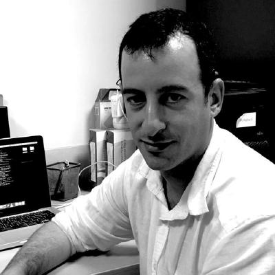

I serve as an Assistant Professor at the Department of Informatics of [Athens University of Economics and Business](https://aueb.gr/en) while I am a researcher at [Archimedes, Athena Research Center](https://www.athenarc.gr/en/archimedes) and affiliated with [Stockholm University](https://dsv.su.se/en/). 
Previously, I held the position of Senior Lecturer (fixed-term) in NLP and Data Science at the Department of Computer and Systems Sciences of [Stockholm University](https://dsv.su.se/en/), and had the privilege of being a visiting scholar at the [Venice Centre for Digital and Public Humanities](https://vedph.github.io/), Ca' Foscari University of Venice.
My research is dedicated to Machine Learning for NLP, with a focus on applications in Social Sciences & Humanities, and Healthcare.
I am also a member of the Athena Research Center team in [AIRIS](https://airis-ai.eu/), a Horizon Europe project developing multimodal generative AI for biomedical research.

--- 

* E-mail: ipavlopoulos (or annis) at aueb dot gr
* Office Address: Antoniadou Wing, 3rd Floor (A308), Patision 76, Athina 104 34
* Office hours: Monday/Friday 1pm EEST
* Phone: +30 210 82 03 133

## News

- 🎓 **September 2026**: Our papers on benchmarking open-weight LLMs for Modern Greek and efficient Greek clinical text de-identification were part of [SETN 2026](https://www.setn2026.tuc.gr/en/program/schedule) in Chania. See [publications]({{ '/publications/' | relative_url }}).
- 📢 **September 2026**: Co-coordinated WG2, Document or Handwriting Classification, with Maria Konstantinidou and Paraskevi Platanou at the [2nd SCOOP Exchange Meeting](https://indico.global/event/18380/timetable/?view=standard_numbered) in Vienna.
- 🎓 **September 2026**: Our work on [Composite Silhouette](https://doi.org/10.1007/978-3-032-37654-1_38) was presented at ECML PKDD 2026 in Naples. [Code and slides](https://pypi.org/project/compsil/).
- 🎓 **September 2026**: Our [Learning Diachronic Representations of Ancient Greek Letterforms](https://doi.org/10.1007/978-3-032-36039-7_10) was presented at ICDAR 2026 in Vienna. [Code and data](https://github.com/ipavlopoulos/diachronic-greek-letterforms).
- 📢 **August 2026**: Gave a talk on Machine Learning for the Humanities in the AI and Byzantine Studies roundtable at the [25th International Congress of Byzantine Studies](https://www.icbs2026.org/program/) in Vienna.
- 🎓 **June 2026**: [CAKE: Confidence in Assignments via K-partition Ensembles](https://doi.org/10.1016/j.mlwa.2026.100915) appears in Machine Learning with Applications. [Code](https://github.com/semoglou/cake).
- 🎓 **May 2026**: [SpaRAGraph: Spatial Reasoning using Retrieval-Augmented Generation](https://doi.org/10.1145/3799424) is out in ACM Transactions on Spatial Algorithms and Systems.
- 📢 **March 2026**: Gave a research seminar on Learning to Align: Addressing Frequency Distribution Shifts at the [Department of Statistics, AUEB](https://www.dept.aueb.gr/el/stat/content/ereynitikaseminaria).
- 📢 **September 2025**: Gave a talk about AI for the Humanities ([AI-based methods for the Humanities at BIFOLD](https://www.bifold.berlin/news-events/events/ai-based-methods-for-the-humanities/agenda-and-program))
- 🎓 **July 2025**: Our (2nd) Nature paper is out ([predictingthepast.com](https://predictingthepast.com)).
- 🎓 **July 2025**: Our survey on NLP for Greek is online ([cell.com/patterns](https://www.cell.com/patterns/fulltext/S2666-3899(25)00161-8)).
- 📢 **June 2025**: Gave a talk about HTR at Princeton ([cdh.princeton.edu](https://cdh.princeton.edu/events/2025/06/scoop-source-codes-of-the-past-launching-an-international-atrhtr-network-for-manuscript-analysis/)).

See all [publications]({{ '/publications/' | relative_url }}) and [talks]({{ '/talks/' | relative_url }}).
