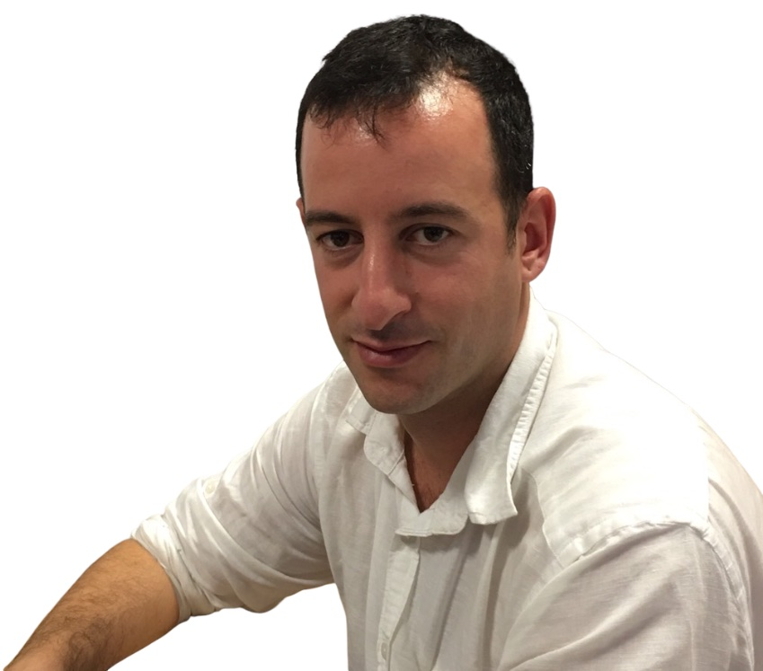

Assistant Professor (elected) at the Department of Informatics of [Athens University of Economics and Business](https://aueb.gr/en) and affiliated with [Stockholm University](https://dsv.su.se/en/). 
I have previously served as a Senior Lecturer (fixed-term) in NLP and Data Science at the Department of Computer and Systems Sciences of [Stockholm University](https://dsv.su.se/en/), and was a visiting scholar at the [Venice Centre for Digital and Public Humanities](https://vedph.github.io/), Ca' Foscari University of Venice.

My research is focused on Machine Learning for NLP. 
Applications of my work lie mainly in the domain of Digital Humanities, 
and I am also a member of the Editorial Board of the [magazén International Journal for Digital and Public Humanities.](https://edizionicafoscari.unive.it/en/edizioni4/riviste/magazen/info)

I teach the course of Language Technology at the [MSc in Digital Methods for the Humanities](https://www.dept.aueb.gr/en/dmh) and the course of Practical Data Science at the [MSc in Data Science](https://datascience.aueb.gr).
